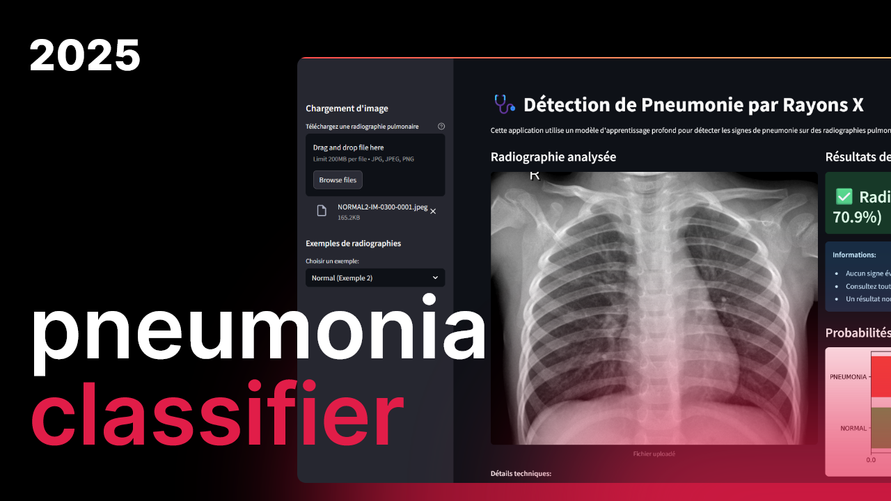

# 🩺 Pneumonia Classifier (2025)



🩺 This repository is made to contain a deep learning-based pneumonia detection system from chest X-ray images. The application provides a user-friendly interface for medical professionals to quickly analyze X-ray images and get preliminary pneumonia detection results.

## ✨ Key Features

- 🧠 Deep learning model with ResNet18 architecture
- 🏥 Medical-grade pneumonia detection from chest X-rays
- 📊 Probability visualization and clinical recommendations
- 🖼️ Support for multiple image sources (upload, local examples)
- ⚡ Fast inference time (CPU/GPU compatible)
- 🛡️ Built-in medical disclaimer and safety warnings

## 🛠️ Technical Stack

- 📦 Package management with Streamlit
- 🖥️ Interactive web interface with Streamlit components
- 🏗️ Model architecture with PyTorch
- 🖼️ Image processing with Pillow
- 📈 Visualization with Matplotlib
- 🔢 Scientific computing with NumPy

## 🚀 Getting Started

### Prerequisites

- Python 3.8+
- pip package manager
- (Optional) NVIDIA GPU with CUDA for accelerated inference

### Installation

1. Clone the repository:
```bash
git clone https://github.com/darckass/pneumonia-classifier.git
cd pneumonia-classifier
```

2. Create and activate a virtual environment (recommended):
```bash
python -m venv venv
source venv/bin/activate  # On Windows use: venv\Scripts\activate
```

3. Install dependencies:
```bash
pip install -r requirements.txt
```

### Download Model Weights

Before running the application, you need to download the pre-trained model weights. Place the `pneumonia_model.pth` file in the project root directory.

### Running the Application

Start the Streamlit application:
```bash
streamlit run app.py
```

The application will automatically open in your default browser at `http://localhost:8501`.

## 🏗️ Model Training

If you want to retrain the model:

1. Ensure you have the dataset properly organized in `data/train`, `data/test`, and `data/val` directories.

2. Run the training script:
```bash
python train_model.py
```

3. The trained model will be saved as `pneumonia_model.pth`.

## 📂 Project Structure

```
pneumonia-classifier/
├── app.py                # Main Streamlit application
├── train_model.py        # Model training script
├── pneumonia_model.pth   # Pre-trained model weights
├── requirements.txt      # Python dependencies
├── README.md            # Project documentation
├── thumbnail.png        # Project thumbnail
└── data/                # Dataset directory (not included in repo)
    ├── train/
    │   ├── NORMAL/
    │   └── PNEUMONIA/
    ├── test/
    │   ├── NORMAL/
    │   └── PNEUMONIA/
    └── val/
        ├── NORMAL/
        └── PNEUMONIA/
```

## ⚠️ Important Disclaimer

This application is for educational and research purposes only. It does not constitute medical advice and should not be used as a substitute for professional medical diagnosis. Always consult with a qualified healthcare provider for medical concerns.

## 📄 License

This project is licensed under the MIT License - see the [LICENSE](LICENSE) file for details.

## 📧 Contact

For questions or collaborations, please contact [leny.sauzet@gmail.com].